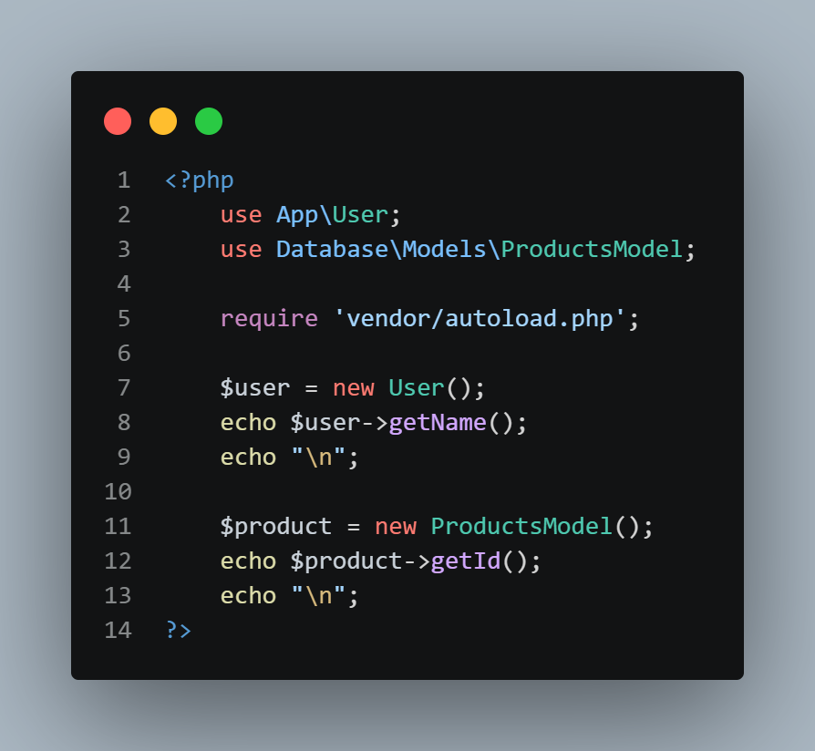
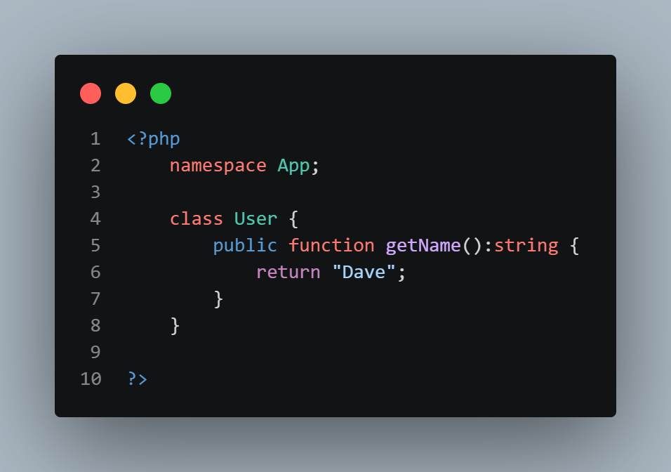
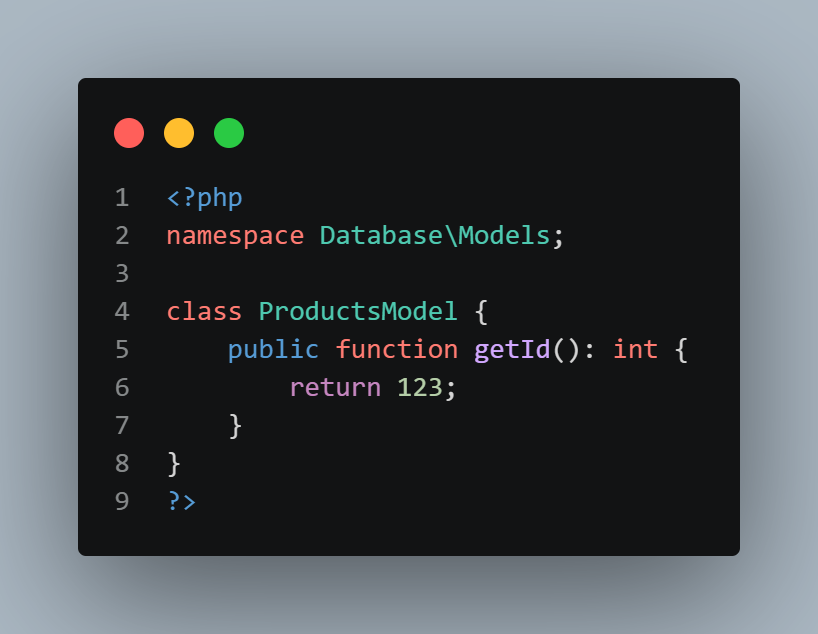
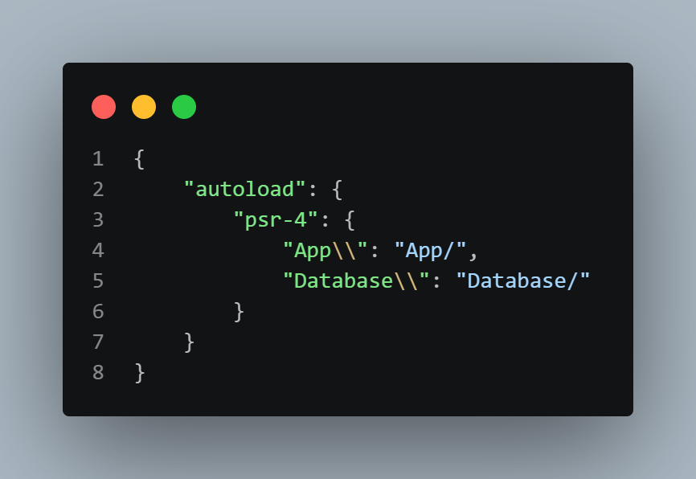

# Laboratorio #4 - PSR-4 PHP
**Alumno: Joseph Córdoba | Cédula: 8-1025-2381 | Grupo: 1GS131 | Profesora: Ingeniera Irina Fong**

<p align="center"><a href="https://laravel.com" target="_blank"></a></p>

 


## Descripción
Este proyecto implementa el estándar **PSR-4** utilizando Composer para la carga automática de clases, organizando correctamente los Namespaces y la estructura de carpetas en una aplicación PHP.  

## Estructura del Proyecto
La organización del proyecto sigue una estructura modular basada en el estándar **PSR-4**, donde cada carpeta representa un espacio lógico dentro de la aplicación. Esto permite mantener el código ordenado, escalable y fácil de mantener.

Las clases se ubican en directorios que corresponden directamente a sus respectivos namespaces, facilitando la carga automática mediante Composer.

```bash
PSR-4/
├── App/
│   └── User.php
├── Database/
│   └── Models/
│       └── ProductsModel.php
├── vendor/
├── composer.json
├── index.php
```
## Namespaces y Estructura

El proyecto implementa el estándar **PSR-4**, el cual establece una relación directa entre los namespaces definidos en el código y la estructura de carpetas del sistema.

Gracias a esta convención, Composer puede cargar automáticamente las clases sin necesidad de incluir manualmente cada archivo.

| Namespace                | Ruta Física                     |
|-------------------------|--------------------------------|
| App\                    | /App                           |
| App\User                | /App/User.php                  |
| Database\               | /Database                      |
| Database\Models         | /Database/Models               |
| Database\Models\ProductsModel | /Database/Models/ProductsModel.php |

## Instalación y Configuración

Sigue los siguientes pasos para ejecutar el proyecto correctamente en tu entorno local.

### 1. Clonar el repositorio

```bash
git clone https://github.com/Yosek-Y/PSR-4_DS7.git
```
### 2. Acceder a la carpeta del proyecto
```bash
cd tu-repositorio
```
### 3. Instalar dependencias con Composer
Este comando descargará todas las dependencias necesarias y generará la carpeta vendor/.

Ejecutamos el comando
```bash
composer install
```
### 4. Generar o actualizar el autoload (opcional)
```bash
composer dump-autoload
```
### 5. Ejecutar el proyecto
Puedes ejecutar el proyecto desde un servidor local como XAMPP o usando el servidor embebido de PHP:
```bash
php -S localhost:8000
```
Luego abre tu navegador en:
```bash
http://localhost:8000
```
Tambien puedes ejecutar el archivo **index.pxp** directo desde la terminal de Visual Studio Code:
```bash
php index.php
```
### Notas importantes
```md
- La carpeta `vendor/` no está incluida en el repositorio, por lo que es obligatorio ejecutar `composer install`.
- Asegúrate de tener PHP y Composer instalados en tu sistema.
- El autoload se basa en el estándar PSR-4 definido en el archivo `composer.json`.
```
## Conclusiones Técnicas

Durante el desarrollo del laboratorio utilizando Composer y el estándar PSR-4, se identificaron varias ventajas clave relacionadas con la organización, rendimiento y escalabilidad del proyecto.

### Mantenibilidad

El uso de PSR-4 permite una estructura clara donde cada clase está directamente asociada a su namespace y ubicación en el sistema de archivos.  
Esto facilita la incorporación de nuevas clases sin necesidad de modificar archivos globales o incluir manualmente dependencias, reduciendo el riesgo de errores y mejorando la organización del código.

### Eficiencia de Memoria (Lazy Loading)

Composer implementa un sistema de carga automática bajo demanda (Lazy Loading), lo que significa que las clases solo se cargan en memoria cuando son utilizadas.  
Esto optimiza el consumo de recursos del servidor, especialmente en aplicaciones grandes, ya que evita cargar archivos innecesarios durante la ejecución.

### Estandarización

El uso del estándar PSR-4 establece una convención clara y ampliamente adoptada para la organización del código en PHP.  
Esto facilita el trabajo en equipo, ya que otros desarrolladores pueden entender rápidamente la estructura del proyecto, reduciendo la curva de aprendizaje y mejorando la colaboración.

## Pruebas de Ejecución
A continuación se presentan evidencias del correcto funcionamiento del proyecto, incluyendo la estructura de archivos, el código implementado y la ejecución de los comandos necesarios para el autoload con Composer.

### Estructura del Proyecto

Se muestra la organización de carpetas y archivos siguiendo el estándar PSR-4:

<p align="center">
  
</p>

---

### Código Fuente

#### Archivo index.php

<p align="center">
  
</p>

#### Clase User

<p align="center">
  
</p>

#### Modelo ProductsModel

<p align="center">
  
</p>

#### Composer json

<p align="center">
  
</p>

---

### Ejecución de Comandos

Se evidencia la ejecución de los comandos necesarios para la gestión de dependencias y generación del autoload:

#### Composer install

<p align="center">
  
</p>

#### Composer dump-autoload

<p align="center">
  
</p>

---

### Resultado Final

Se muestra el resultado final del proyecto en ejecución, confirmando que la carga automática de clases funciona correctamente:

<p align="center">
  
</p>

## Información del Proyecto

| Campo              | Detalle                  |
|--------------------|--------------------------|
| Autor              | Joseph Córdoba           |
| Cédula             | 8-1025-2381              |
| Grupo              | 1GS131                   |
| Correo Personal    | josephcordoba2318@gmail.com  |
| Correo Institucional  | joseph.cordoba@utp.ac.pa  |
| Curso              | Desarrollo de Software VII   |
| Profesora          | Ing. Irina Fong          |
| Fecha de Ejecución | 05/05/2026               |
